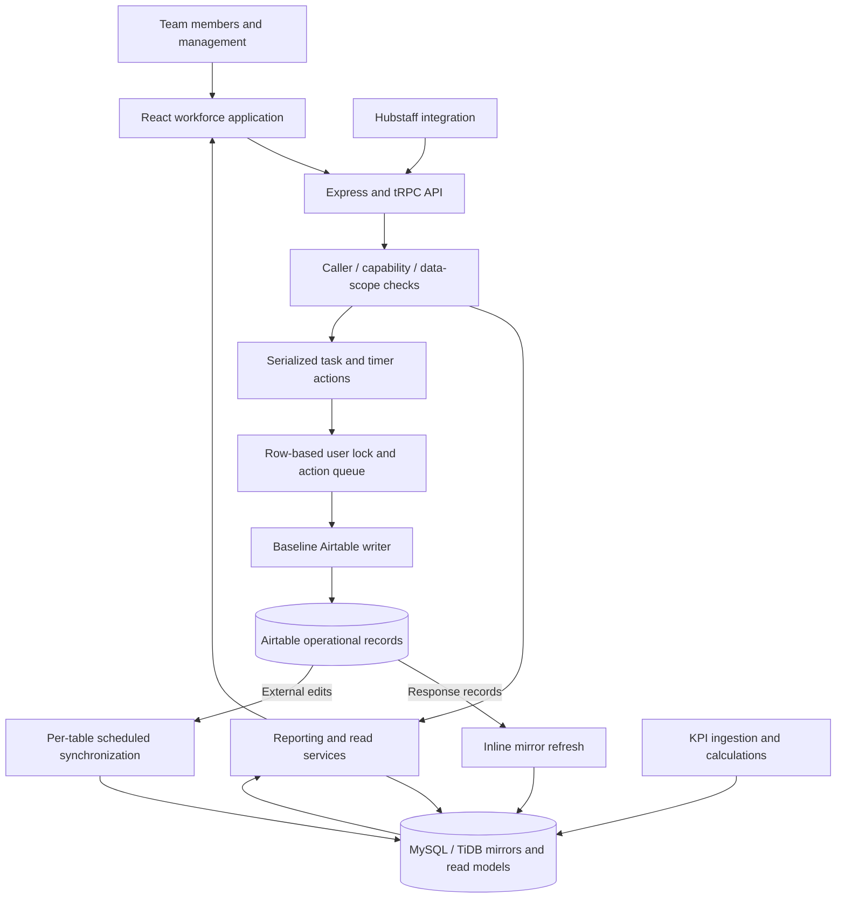
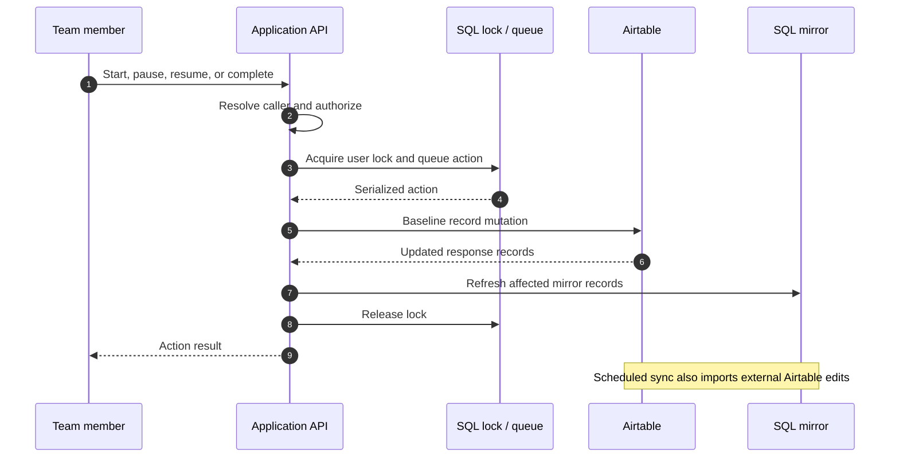
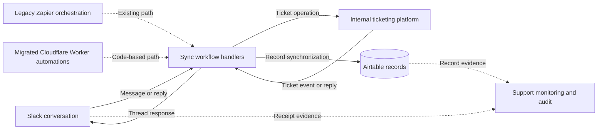
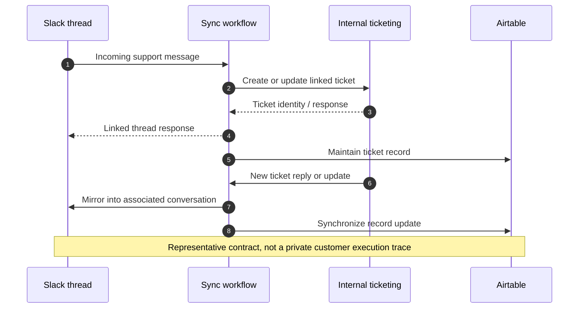
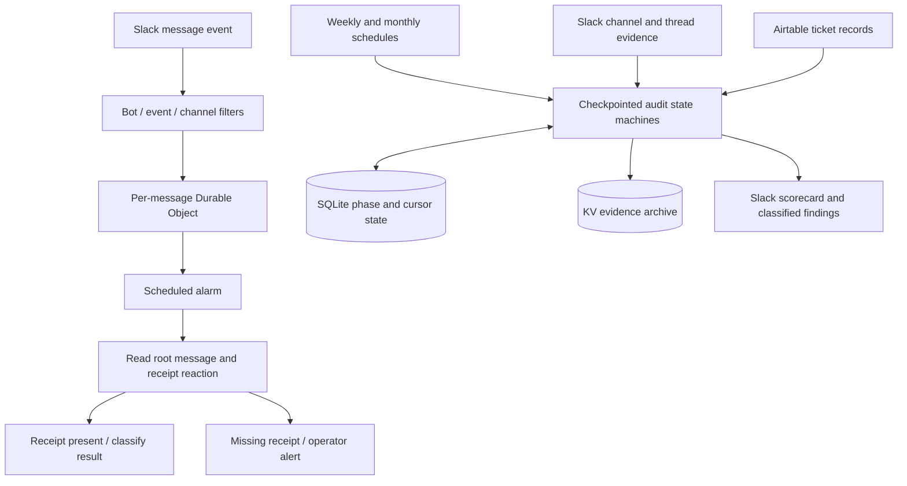
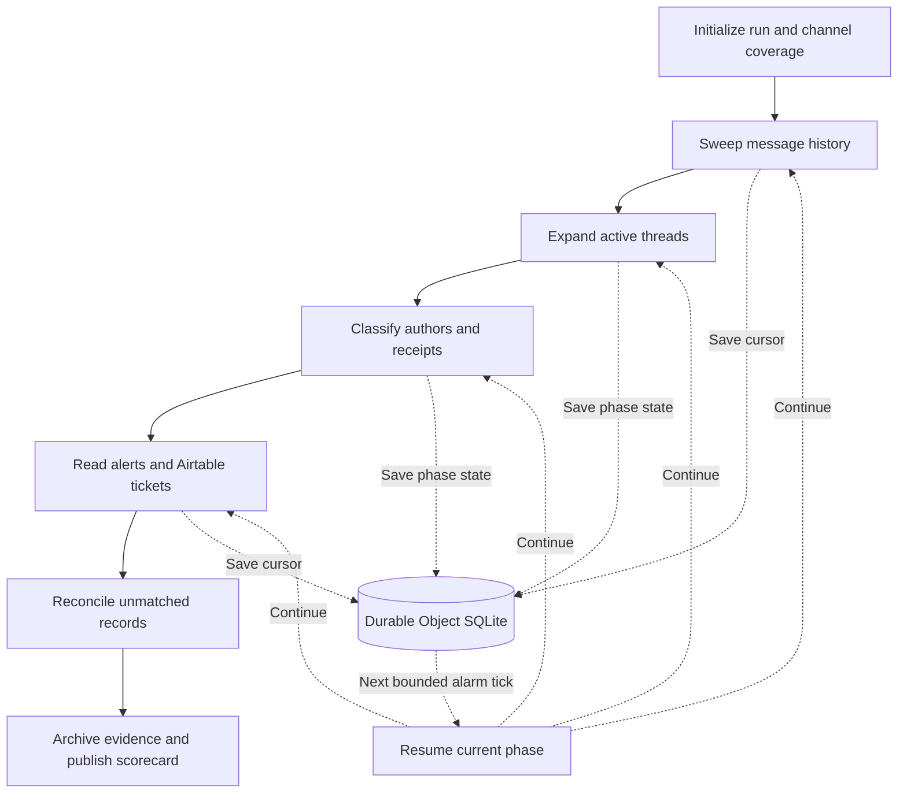
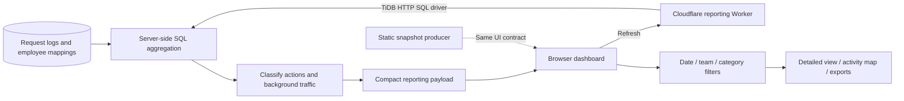

# Baam engineering case studies

[Read the case studies](https://zulfkicar.github.io/case-studies/)

These are public architecture narratives, not releases of workplace code or data. The source definitions below also generate the static portfolio pages.

## Operational AI memory layer

A Cloudflare-hosted memory layer connects internal process documentation to an LLM backend so responses can use the company’s own operational context.

[Read the full case study](https://zulfkicar.github.io/case-studies/memory-layer/)

**Scope:** This page is a written overview of the capabilities I implemented. No workflow diagram, deployment topology, or training internals are published. No standalone accuracy or time-saving figure is assigned to this system.

## Central workforce platform

Tasks, time tracking, team activity, and KPIs become one management tool, while Airtable and the application continue to exchange updates.

[Read the full case study](https://zulfkicar.github.io/case-studies/workforce-platform/)

### Separate the read path from the write path

Baseline architecture: serialized application actions write through the Airtable client, then refresh the SQL mirror. Scheduled jobs bring external Airtable edits back into the application.

### Follow a task action through the system

The direct-write path uses the provider’s response to refresh the mirror. Database-authoritative and outbox paths are gated migration modes, discussed below.

**Scope:** The diagram describes the baseline flow in the inspected implementation. It does not claim that all reads are SQL-only or that every writer family is database-authoritative. No before/after productivity or latency result is claimed.

## Slack–ticketing–Airtable synchronization

A bidirectional bridge keeps Slack and the internal ticketing platform connected, with ticket records synchronized to Airtable for operational record keeping.

[Read the full case study](https://zulfkicar.github.io/case-studies/ticket-sync/)

### Conversation, ticket, and record

Logical topology of the workplace integration. Zapier exports document the legacy orchestration. Migrated automations use Cloudflare Workers. The diagram does not imply that every exported path has been ported.

### A conversation crosses the boundary

A representative exchange explains the dual-sync contract. Internal API names, identities, and payloads are abstracted. It is not an execution trace from a customer ticket.

**Scope:** The topology and ownership are based on my implementation account, supported by the export structures and integration documentation. No live private endpoints are exposed, and no exactly-once delivery or complete migration claim is made.

## EchoBot and ticket-sync audit

Delayed checks catch unattended messages. Scheduled audits check channel coverage and reconcile ticket records, including failures the live checks cannot see.

[Read the full case study](https://zulfkicar.github.io/case-studies/support-monitoring/)

### Live checks and structural audits

The message detector uses a per-message Durable Object. Scheduled audit state machines compare Slack and Airtable evidence and publish scorecards.

### A long audit becomes resumable work

The monthly implementation checkpoints phase and cursor state in SQLite, advances through bounded alarm ticks, then writes evidence to KV and a scorecard to Slack.

**Scope:** The architecture is supported by source and documentation. No missed-ticket reduction, audit accuracy, or measured time savings is claimed. A receipt-based alert remains a heuristic rather than direct confirmation of every provider write.

## Workforce usage observability

A read-only reporting Worker turns application request logs into recognizable actions, team views, and activity patterns.

[Read the full case study](https://zulfkicar.github.io/case-studies/usage-observability/)

### Aggregate on the server, explore in the browser

The Worker reads request logs and employee mappings through the TiDB HTTP driver. A compact reporting payload feeds the dashboard and client-side filters.

**Scope:** The case study publishes the reporting architecture, not employee records or production telemetry. Retention limits the available history. No headcount, individual activity, or benchmark performance figures are published.

## Rebuild

From the portfolio root, run `node scripts/build-case-studies.mjs` to regenerate HTML and this Markdown file from `case-studies/content.mjs`.

SVGs are static builds of the `.mmd` files using [Mermaid CLI](https://github.com/mermaid-js/mermaid-cli). With Mermaid CLI 11.12.0 installed, run `mmdc -i case-studies/diagrams/NAME.mmd -o case-studies/diagrams/NAME.svg -c case-studies/mermaid-config.json -b transparent`. No diagram runtime or external model calls are required by visitors.
