# Engineering case studies

[Read the case studies](https://zulfkicar.github.io/case-studies/)

Applied AI, business software, automation and integrations, reliability, and analytics from operational work at Baam. These case studies describe problems, system designs, and implementation limits. They do not release workplace code or data.

## Operational AI memory layer

A company knowledge layer connects process documentation, vector retrieval, and an LLM backend to answer questions with operational context.

[Read the full case study](https://zulfkicar.github.io/case-studies/memory-layer/)

**Scope:** This overview describes the capabilities I implemented. Architecture and model-training details are not available for a technical walkthrough. Retrieval accuracy and time savings were not measured separately.

## Central workforce platform

Tasks, time tracking, team activity, and KPIs become one management tool, while Airtable and the application continue to exchange updates.

[Read the full case study](https://zulfkicar.github.io/case-studies/workforce-platform/)

### Separate the read path from the write path

Baseline architecture: serialized application actions write through the Airtable client, then refresh the SQL mirror. Scheduled jobs bring external Airtable edits back into the application.

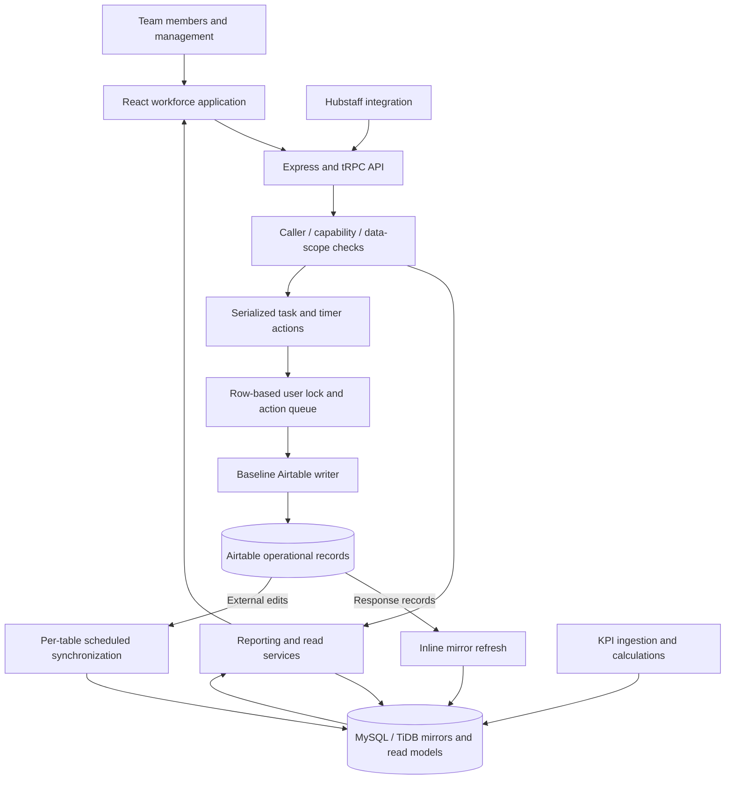

### Follow a task action through the system

The direct-write path uses the provider’s response to refresh the mirror. Database-authoritative and outbox paths are gated migration modes, discussed below.

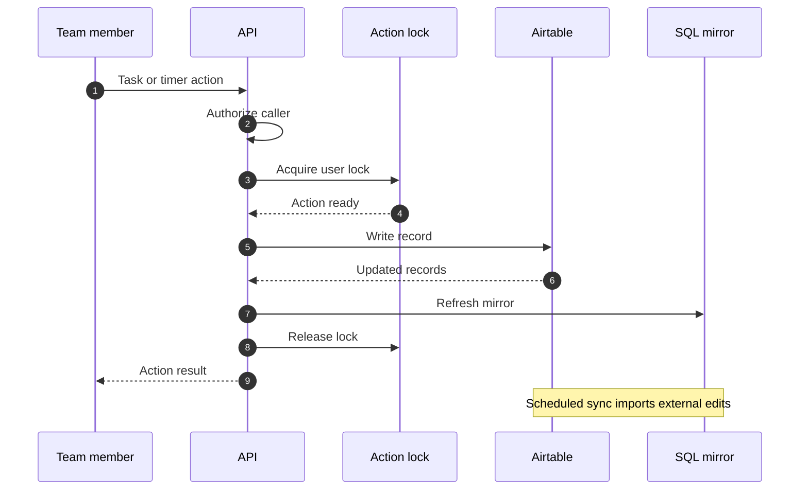

**Scope:** The map shows the Airtable-first write path. SQL supports reporting and mirrored records, while database-first writes are introduced gradually. Reporting still uses a mix of data sources. Productivity and latency changes have not been benchmarked.

## Slack and ticketing synchronization

Slack conversations and support tickets stay linked in both directions, with Airtable providing a reporting copy of the ticket records.

[Read the full case study](https://zulfkicar.github.io/case-studies/ticket-sync/)

### Conversation, ticket, and record

Slack and the ticketing platform exchange messages and updates. Airtable receives ticket records for reporting. Zapier and Cloudflare Workers represent the legacy and migrated execution paths.

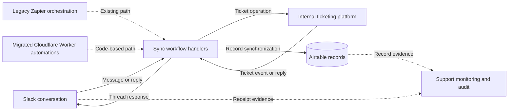

### A conversation crosses the boundary

A support message creates or updates a linked ticket. Replies return to the same Slack thread, while changes also update the reporting record. This sequence illustrates the flow rather than replaying a live ticket.

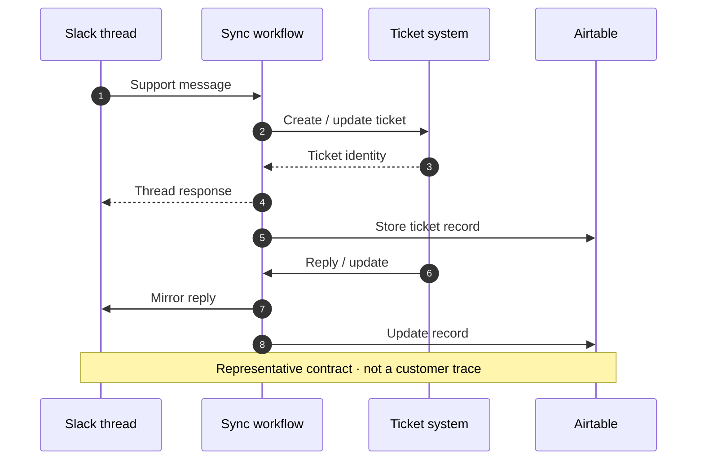

**Scope:** The diagrams simplify the integration to show the main handoffs. The wider migration’s savings are reported separately from this service. Not every workflow has moved to Workers, and the system does not promise exactly-once delivery.

## Support monitoring and ticket reconciliation

Delayed checks catch unattended messages. Scheduled audits check channel coverage and reconcile ticket records, including failures the live checks cannot see.

[Read the full case study](https://zulfkicar.github.io/case-studies/support-monitoring/)

### Live checks and structural audits

The message detector uses a per-message Durable Object. Scheduled audit state machines compare Slack and Airtable evidence and publish scorecards.

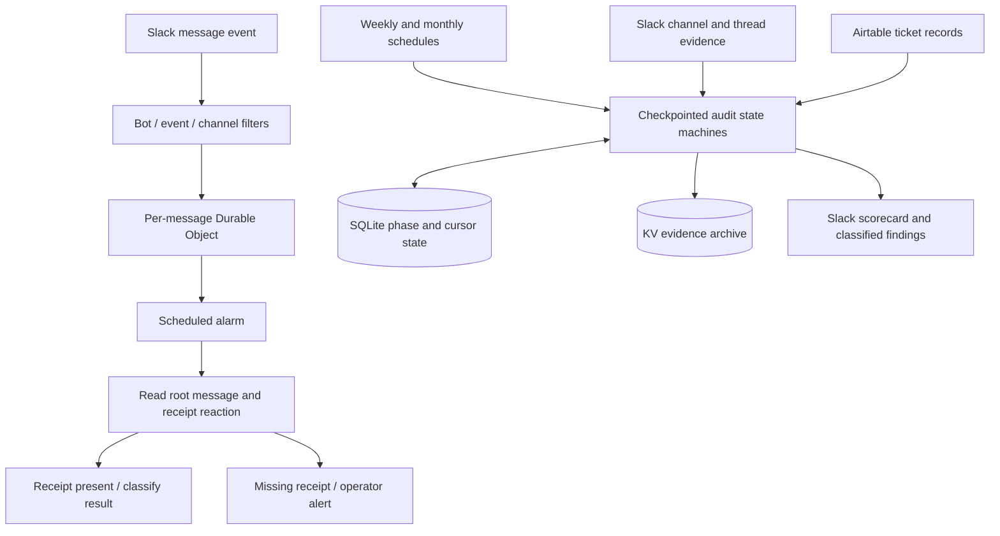

### A long audit becomes resumable work

The monthly implementation checkpoints phase and cursor state in SQLite, advances through bounded alarm ticks, then writes evidence to KV and a scorecard to Slack.

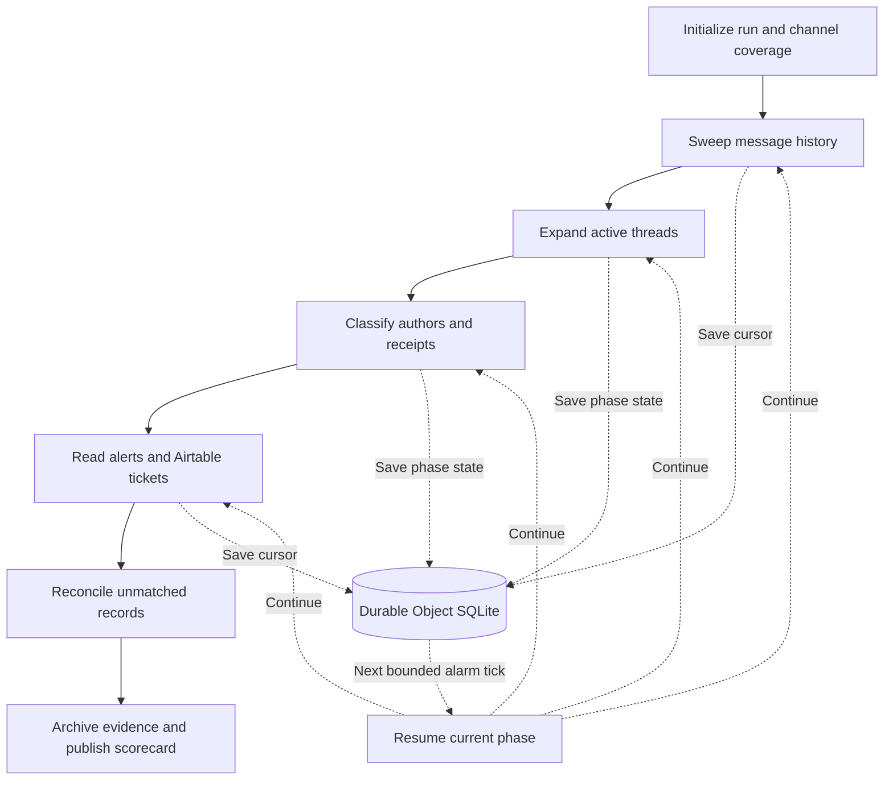

**Scope:** Receipt checks are a heuristic for acknowledgment. They do not prove that every downstream record exists. Scheduled audits address coverage and record consistency, but detection accuracy and missed-ticket reduction have not been benchmarked.

## Workforce activity analytics

A read-only reporting Worker turns application request logs into recognizable actions, team views, and activity patterns.

[Read the full case study](https://zulfkicar.github.io/case-studies/usage-observability/)

### Aggregate on the server, explore in the browser

The Worker reads request logs and employee mappings through the TiDB HTTP driver. A compact reporting payload feeds the dashboard and client-side filters.

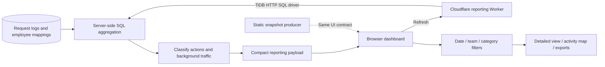

**Scope:** The dashboard measures recorded application activity, not offline work or task quality. Available history depends on log retention. Employee records and production telemetry are excluded from this case study.

## Employee updates and acknowledgment tracking

Scheduled announcements, reusable recipient delivery, and two acknowledgment deadlines connect communication to a follow-up process.

[Read the full case study](https://zulfkicar.github.io/case-studies/employee-updates/)

### Publish, deliver, then check acknowledgment

Publication and acknowledgment monitoring run as separate workflows. Recipient lists are deduplicated before delivery, while Airtable records support reminders and deadline checks.

```mermaid
flowchart LR
  A[Update record] --> WAIT[Publication time and filters]
  WAIT --> PUB[Shared delivery workflows]
  PUB --> DEDUP[Merge and deduplicate recipients]
  DEDUP --> LOOP[Per-person lookup and Slack delivery]
  LOOP --> LOG[(Delivery and acknowledgment records)]
  LOG --> D1[First deadline and HTTP check]
  D1 --> REM[Record updates and reminders]
  REM --> D2[Second deadline and HTTP check]
  D2 --> FOLLOW[Record updates and further follow-up]
```

**Scope:** The map summarizes the configured process. One delivery path needs an end-to-end execution check because it contains an early return. Delivery and acknowledgment rates have not been measured here.

## Billing-request intake and completion

A structured Slack submission becomes an Airtable request. A separate reaction-driven path updates the matching record when the request is completed.

[Read the full case study](https://zulfkicar.github.io/case-studies/billing-requests/)

### Two events, one operational record

The message path filters, parses, looks up context, and creates a request. The reaction path filters a completion signal and updates a matching record. It records the request lifecycle; it does not execute a refund.

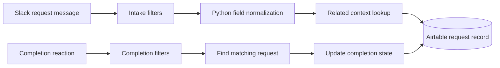

**Scope:** This is a request-tracking workflow, not a payment system. The parser handles the documented message format, but accuracy across arbitrary submissions has not been benchmarked.

## Automation failure and connection alerts

A historical alerting workflow turned provider notices into Slack messages, preserving error context and links so operators could respond.

[Read the full case study](https://zulfkicar.github.io/case-studies/automation-alerts/)

### Convert provider notices into usable alerts

An email trigger feeds error extraction and conditional routing before Slack notification. This is a historical workflow, not an active monitoring service.

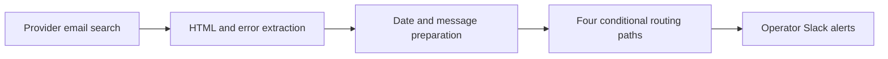

**Scope:** This workflow is a historical implementation and is no longer enabled in the documented configuration. It demonstrates alert transformation and routing, not current monitoring coverage or automated recovery.

## Escalation routing and lifecycle updates

Support reactions resolve thread context, select the appropriate route, update linked records, and return a response to the conversation.

[Read the full case study](https://zulfkicar.github.io/case-studies/escalation-routing/)

### Resolve context before changing state

The map groups repeated lookup, update, and response steps. Conditional paths preserve different outcomes when record context is missing or a different response is needed.

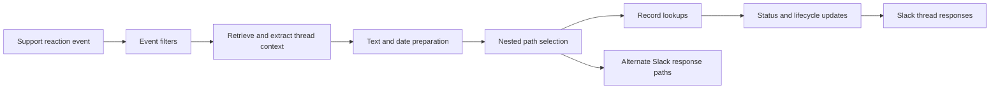

**Scope:** This map groups a larger handler for readability. It does not imply that every older workflow has been retired or replaced. Resolution-time and ticket-volume improvements have not been measured separately.

## Documentation coverage

The reviewed configuration archive contains 48 name-tagged entries across the families below. Counts include shared work, copies, and retired or disabled definitions. They are documentation coverage, not a claim of 48 independently authored or currently deployed systems.

| Workflow family | Entries | Coverage |
| --- | ---: | --- |
| Time tracking and clock state | 3 | Hubstaff clock events, Airtable updates, and a webhook email service. |
| Support conversation integration | 3 | Messages, context lookups, ticket operations, and record creation. |
| Escalation and support-state handling | 10 | Reaction triggers, nested paths, status updates, and timestamps. |
| Operational communications | 7 | Record- and webhook-driven messages, loops, and scheduled delays. |
| Employee announcements and acknowledgments | 4 | Reusable delivery, recipient deduplication, and two deadline checks. |
| Billing-request lifecycle | 2 | Structured intake parsing and reaction-driven completion. |
| Automation health checks | 3 | Provider notices, ticket-sync errors, and reaction checks. |
| Onboarding and stakeholder notifications | 5 | Welcome messages, request notifications, and thread participation. |
| Intake, entitlement, and record synchronization | 5 | Webhook intake, record matching/upserts, and code-based entitlement selection. |
| Booking and call coordination | 4 | Checklist updates, cancellation alerts, and spreadsheet records. |
| Commission communications | 1 | Conditional email communications. |
| Account-support utility | 1 | Historical account-support configuration, excluded from public detail. |

## Rebuild

From the portfolio root, run `node scripts/build-case-studies.mjs` to regenerate HTML and this Markdown file from `case-studies/content.mjs`.

Flowcharts use hand-arranged component cards from `scripts/architecture-maps.mjs`, with every edge parsed and validated against its `.mmd` source. Sequence SVGs are static builds of the `.mmd` files using [Mermaid CLI](https://github.com/mermaid-js/mermaid-cli). With Mermaid CLI 11.12.0 installed, run `mmdc -i case-studies/diagrams/NAME.mmd -o case-studies/diagrams/NAME.svg -c case-studies/mermaid-config.json -b transparent`. The explorer uses local inline SVG, pointer and keyboard navigation, and curated component explanations. No diagram runtime, external model calls, or export data is required by visitors.
