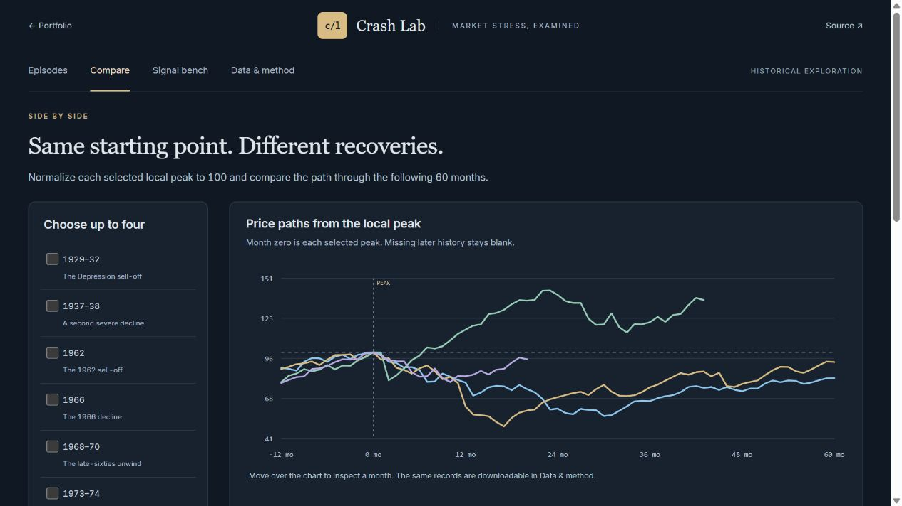

# Crash Lab

[Open the live lab](https://zulfkicar.github.io/crash-lab/)



A browser research workspace with 17 historical U.S. equity-decline windows, peak-aligned price comparisons, an all-month warning-signal bench, and downloadable primary-source records. No backend, runtime package, account, or model API is required.

## Run

Serve this directory with any static HTTP server. Local JSON loads through fetch, so a file URL is insufficient. From this directory:

```sh
npm test
```

## Data and attribution

| Source                                                                                            | Fields and aggregation                                                                           |
| ------------------------------------------------------------------------------------------------- | ------------------------------------------------------------------------------------------------ |
| [Robert Shiller, Yale](https://www.econ.yale.edu/~shiller/data.htm)                               | Nominal S&P composite monthly price, CAPE, and long rate from the original workbook.             |
| [Cboe VIX history](https://www.cboe.com/tradable_products/vix/vix_historical_data)                | Monthly mean of daily CLOSE values, at least 10 valid observations.                              |
| [Federal Reserve Bank of St. Louis, T10Y3M via FRED](https://fred.stlouisfed.org/series/T10Y3M)   | Monthly mean of the daily 10-year minus 3-month Treasury spread, at least 10 valid observations. |
| [Federal Reserve Bank of St. Louis, STLFSI4 via FRED](https://fred.stlouisfed.org/series/STLFSI4) | Monthly mean of the weekly financial-stress index, at least 3 valid observations.                |

Raw files were retrieved October 5, 2026. Download URLs, original byte counts, SHA-256 fingerprints, and coverage are in data/snapshot.json. Data retains its source attribution and terms.

The supplied Shiller workbook ends in September 2023. The final row is explicitly a September 1 price, so the analysis excludes it and ends in August 2023. Newer FRED/VIX observations do not extend the price-target window. The earlier page's unsourced extension to 2026 is excluded.

Price coverage starts in January 1871, CAPE in January 1881, the curve spread in January 1982, VIX in January 1990, and aligned financial stress in January 1994. Older composite prices are a predecessor series rather than today's 500 constituents. Missing indicators are not filled or treated as zero.

## Reproduce the frozen snapshot

```sh
python -m pip install -r scripts/requirements.txt
python scripts/build_data.py --as-of 2026-10-05
npm test
```

Python and xlrd 2.0.2 are needed only for rebuilding. The builder reads checked-in source files and makes no network requests. Its retrieval date describes the frozen files. A new source download needs updated metadata and a review of workbook notes and coverage.

## Episode measurement

Peak = highest monthly price in the declared peak window. Trough = lowest subsequent monthly price through the declared trough-window end. Recovery = the first later month at or above that selected local peak. An unrecovered series is right-censored at the snapshot end.

The catalogue deliberately includes both major crashes and smaller corrections. Its historical windows can overlap and are not independent events. The 1937 local decline, for example, falls within the longer 1929 all-time-high drawdown. The separate automatic catalogue detects drawdowns from a running all-time high across the full price record.

Comparisons normalize each local peak to 100, showing 12 preceding and 60 following months. The table may report a recovery beyond the plotted window. Missing later history stays blank.

Prices are nominal monthly averages. They exclude dividend reinvestment and inflation adjustment. Fast daily shocks such as 1987 and 2020 appear shallower on this measure. A recovered price does not imply a recovered real or total-return portfolio.

## Signal experiment

For decision month t, read the indicator at t minus the selected lag. The default is one month. A target occurs when any price in t+1 through t+H is at least D percent below the decision-month price. H defaults to 12 months and D to 20 percent. The future window labels the outcome only and never contributes to the alert.

A complete calendar horizon is required. Incomplete future windows are excluded uniformly, even if a target decline occurred before censoring. This avoids treating censored positive and negative observations differently.

Illustrative defaults: CAPE at least 30, curve spread below zero, VIX at least 25, financial stress at least 1. These rules are transparent choices, not fitted or preregistered thresholds. Every eligible month is evaluated, rather than only selected catalogue episodes. Common coverage is enabled by default for identical comparison samples.

Precision = TP/(TP+FP). Recall = TP/(TP+FN). Base rate = (TP+FN)/N. Undefined ratios remain unavailable. False-alarm stretches group consecutive alerted decision months without the specified target. They do not imply an absence of market stress.

The era comparison groups decisions through 2009 versus 2010 onward. Outcome windows can cross that boundary. No model is fitted and this is not a holdout test. CSV exports include decision and feature dates, observed values, outcomes, threshold, horizon, decline target, lag, and snapshot identifier.

## Limits and next research

Current-vintage observations are not an archive of what was known at each date. STLFSI4 is revised and normalized over a larger sample. The lag is a convention, not a verified publication schedule. The yield curve is commonly studied for recessions, which are a different target from equity-price declines. [New York Fed explanation](https://www.newyorkfed.org/research/capital_markets/ycfaq).

Monthly outcomes overlap and a small number of crises can dominate the counts. Threshold changes after inspecting results are exploratory selection. No calibrated crash probability, independent-sample significance, trading performance, or predictive edge is claimed.

A defensible follow-on study needs a frozen task, point-in-time data or strictly past-derived features, event-aware chronological splits with purged overlapping horizons, simple baselines, and robustness across regimes. This release is the reproducible exploratory stage.

## Verification

The 13 tests exercise known-value drawdowns and recoveries, open recovery censoring, strict future windows, exact threshold boundaries, delayed features, common coverage, no-alert ratios, pre-peak evidence, peak normalization, continuous source coverage, original byte fingerprints, independent VIX aggregation, exported experiment settings, and era partitioning.

## Layout

```text
analysis.js       shared pure calculations, also used by the tests
app.js            four connected research views and controls
charts.js         original SVG plots with pointer and keyboard inspection
lab.css           responsive research interface
data/             raw sources, aligned monthly snapshot, episode definitions
scripts/          deterministic monthly builder
test/             behavior, arithmetic, timing, and source checks
```
